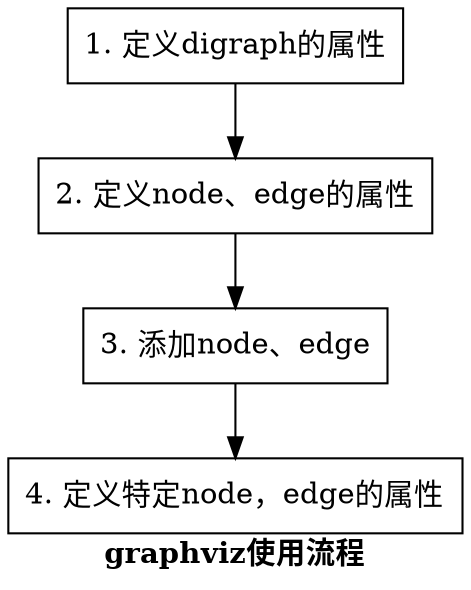

一个完整的Docker有以下几个部分组成：
dockerClient客户端
Docker Daemon守护进程
Docker Image镜像
DockerContainer容器
本章，我将详细的介绍在Ubuntu-18.04中安装并使用Docker，之前在网上找了很多，总结如下：

ffff

ddd

先更新
`sudo apt update`

安装依赖
`sudo apt install apt-transport-https ca-certificates curl software-properties-common`
添加Dokcer官方密钥到系统中
`curl -fsSL https://download.docker.com/linux/ubuntu/gpg | sudo apt-key add -`

添加docker源
`sudo add-apt-repository "deb [arch=amd64] https://download.docker.com/linux/ubuntu bionic stable"`
这里在更新一下源
`sudo apt update`

安装docker
`sudo apt install docker-ce`

命令报错及解决

运行容器
